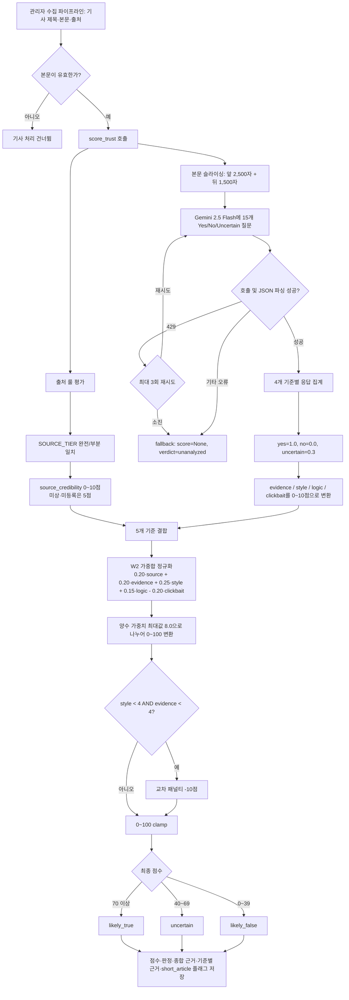
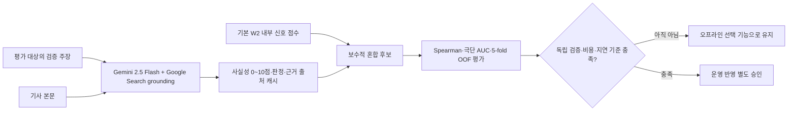
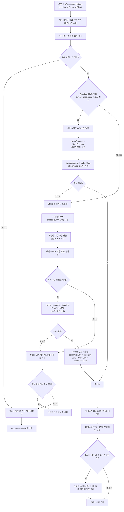

# ET 핵심 기능 처리 흐름 및 정량평가 설계

## 1. 문서 범위와 현재 구현 상태

이 문서는 현재 워크트리의 실제 코드인 `backend/services/trust.py`, `backend/services/recommend.py`, `backend/services/encoder_inference.py`, `backend/services/repo.py`를 기준으로 작성했다.

- 신뢰도 점수는 TELLER Framework(2024)의 문제의식을 참고한 **경량 하이브리드 판별 파이프라인**이다. TELLER 원 모델의 재현이나 미세 조정 모델이 아니라, 출처 룰과 Gemini의 질문별 판정을 가중 합산하는 구현이다.
- 추천은 현재 코드상 **Attention Encoder → 임베딩 프로필 → 카테고리 → 최신순**의 조건부 폴백 체인이다. Render에서 `torch` 또는 체크포인트가 준비되지 않으면 Attention 단계가 자동으로 비활성화되므로, 운영 환경에서는 임베딩 기반 추천이 주 경로가 될 수 있다.
- 로컬 저장소에는 `backend/services/model_weights/attention_encoders.pt`가 있고 현재 로컬 환경의 `encoder_inference.is_model_ready()`는 `True`다. 배포 환경의 실제 활성 경로는 노트북의 런타임 진단 셀에서 별도로 확인해야 한다.

## 2. 신뢰도 점수 산출 프로세스



### 산식과 해석

각 기준 점수를 \(s_i \in [0, 10]\)이라 할 때 현재 점수는 다음과 같다.

```text
raw = 0.20*S_source + 0.20*S_evidence + 0.25*S_style
    + 0.15*S_logic  - 0.20*S_clickbait

score = clamp(int(raw / 8.0 * 100) - cross_penalty, 0, 100)
cross_penalty = 10 if S_style < 4 and S_evidence < 4 else 0
if S_evidence < 4: score = min(score, 69)
```

`clickbait_risk`는 “위험할수록 높은 점수”이며 음수 가중치로 감점한다. 분석 실패는 0점과 구분되는 `None`/`unanalyzed`로 반환된다.

### 선택적 외부 주장 교차검증(오프라인 실험)



서울대 데이터에서는 `_fc_title`이 레이블의 실제 검증 대상이다. 따라서 외부 검색은 기사 전체의 인상 점수가 아니라 그 주장을 직접 대조한다. `backend/training/evaluate_grounded_trust.py`는 `--live`를 명시하지 않으면 외부 호출을 하지 않고 기존 JSONL 캐시만 읽는다.

### 정량평가 질문

| 평가 축 | 핵심 지표 | 의미 |
|---|---|---|
| 레이블 분리력 | ROC-AUC, F1, 정확도, Spearman ρ | 신뢰/불신 레이블과 점수가 일치하는가 |
| 방향성 | 불변쌍 통과율, 점수 차이 margin | 근거 제거·논리 모순·낚시성 삽입 시 올바른 방향으로 변하는가 |
| 안정성 | 반복 실행 표준편차, 판정 일치율 | 동일 기사에 대한 LLM 변동이 허용 범위인가 |
| 강건성 | 파싱 성공률, `unanalyzed` 비율, API 오류율 | 외부 모델 실패를 결과로 오인하지 않는가 |
| 효율 | 기사당 지연시간, 처리량, 호출 성공률 | 운영 비용과 배치 처리 시간이 감당 가능한가 |
| 그룹 점검 | 출처·본문 길이·카테고리별 평균/오류율 | 특정 출처나 단신이 구조적으로 불리하지 않은가 |

`data/trust_eval_samples.jsonl`은 낚시성 기사 분류용이라 사실성 평가에서 제외한다. 사실성은 `data/trust_eval_snu.jsonl`의 5단계 서울대 팩트체크 레이블과 `data/invariant_pairs.jsonl`의 인간 직관 방향성을 함께 사용한다.

## 3. 개인화 추천 프로세스



### 현재 구현에서 꼭 구분할 점

1. `rec_source=encoder`는 Attention 경로, `profile`은 임베딩 프로필 경로, `category`와 `latest`는 폴백 경로다. 운영 로그에서 이 비율을 집계해야 “실제로 어떤 모델이 서비스 중인지” 알 수 있다.
2. stage-2 임베딩 프로필과 `article_chunks.embedding` 검색은 모두 raw Gemini 임베딩 공간을 사용한다. 측정 결과 learned/raw 동일 기사 코사인 평균이 0.173에 불과해 혼합 경로를 제거했다. Attention 경로는 `encode_user`와 `articles.learned_embedding` 공간 안에서만 동작한다.
3. profile 경로는 임베딩으로 후보를 생성한 뒤 인간 직관 페르소나에서 채택한 4개 신호로 재정렬한다. 그 뒤 다양화·신뢰도 가드레일·탐색 슬롯을 적용한다.
4. 클릭 로그가 적으면 모델 품질이 아니라 데이터 부족을 측정하게 된다. 평가 샘플 수와 사용자/세션 수를 항상 지표 옆에 표시해야 한다.

### 정량평가 질문

| 평가 축 | 핵심 지표 | 비교 기준 |
|---|---|---|
| 랭킹 정확도 | HitRate@K, MRR, NDCG@K | hybrid가 profile/category/latest/random보다 높은가 |
| 개인화 부가가치 | hybrid − profile 지표 차이 | 경량 재정렬이 임베딩 단독보다 나은가 |
| 카탈로그 활용 | Coverage@K | 일부 기사에만 추천이 몰리지 않는가 |
| 다양성 | 카테고리 다양성, 최대 카테고리 점유율 | 60% 상한과 탐색 슬롯이 실제로 작동하는가 |
| 안전성 | 저신뢰 기사 Top-K 노출률, 가드레일 위반 수 | 1~39점 기사가 정상 기사보다 앞서지 않는가 |
| 콜드 스타트 | latest/category 폴백 성공률, 빈 응답률 | 이력·임베딩이 없어도 결과가 나오는가 |
| 운영 효율 | p50/p95 지연시간, 메모리, 모델 준비 여부 | Render 제약에서 안정적으로 실행되는가 |
| 데이터 준비도 | 임베딩 보유율, 유효 리플레이 수, 경로별 노출 수 | 품질 결론을 내릴 만큼 데이터가 있는가 |

## 4. 실험 노트북의 실행 모드

`Core_Function_experiment.ipynb`는 한 파일에서 다음 세 모드를 지원한다.

| 모드 | 외부 키/DB | 수행 내용 |
|---|---|---|
| 기본 오프라인 | 불필요 | 산식 단위검증, 기존 신뢰도 캐시 불변쌍 평가, 합성 임베딩 추천 검증, 모델 준비도 진단 |
| 신뢰도 Live | `GEMINI_API_KEY` 필요 | 참조 데이터 일부를 실제 `score_trust`로 평가하고 분류·지연·실패율 산출 |
| 외부 검색 교차검증 | `GEMINI_API_KEY` + 명시적 `--live` | 검증 주장별 Google Search grounding 캐시 생성; 노트북은 캐시만 읽음 |
| 추천 DB Replay | `DATABASE_URL` 필요 | 시간 순서 보존 로그로 hybrid/profile/category/latest/random 비교 |

설정값과 비밀정보는 노트북 셀에 직접 입력하지 않는다. 루트 `.env` 또는 프로세스 환경변수에서 다음 이름을 참조한다.

```env
# 필수 비밀정보 — 값은 저장소에 커밋하지 않음
GEMINI_API_KEY=...
DATABASE_URL=...

# 실험 스위치와 파일 참조
RUN_LIVE_TRUST=0
RUN_DB_RECOMMENDATION=0
TRUST_DATA_PATH=data/trust_eval_snu.jsonl
TRUST_PAIR_PATH=data/invariant_pairs.jsonl
TRUST_CACHE_PATH=FINAL_ANALYSIS/artifacts/optimization/trust_cache_evidence_v2.jsonl
TRUST_CACHE_OVERLAY_PATH=FINAL_ANALYSIS/artifacts/optimization/trust_cache_logic_v3_p5.jsonl
TRUST_GROUNDING_SUMMARY_PATH=FINAL_ANALYSIS/artifacts/optimization/trust_grounding_summary.json
EXPERIMENT_REPORT_DIR=FINAL_ANALYSIS/artifacts/core_function_experiment
MAX_LIVE_SAMPLES=10
TOP_K=3
NEGATIVE_COUNT=3
MIN_HISTORY=1
RANDOM_SEED=42
```

## 5. 권장 판정 게이트

초기 품질 게이트는 데이터가 쌓이면서 조정하되, 현재 프로젝트에서는 다음을 시작점으로 삼는다.

- 신뢰도 불변쌍 통과율 ≥ 80%, Live API 성공률 ≥ 95%, `unanalyzed`를 0점으로 집계하지 않음.
- 신뢰도 이진 평가는 샘플 수와 클래스별 수를 함께 보고하며 ROC-AUC·F1을 동시에 사용.
- 추천은 최소 100개 이상의 시간 순서 보존 리플레이 이후 결론을 내리고, hybrid의 MRR/NDCG가 profile·category·latest·random보다 높아야 함.
- 빈 추천률 0%, 저신뢰 기사 선두 노출 0건, 최종 Top-K 최대 카테고리 점유율 ≤ 60%를 회귀 게이트로 사용.
- 모든 보고서에는 코드 커밋, 실행 시각, 설정 스위치, 샘플 수, 실패 수를 함께 기록.

## 6. 코드 기준 위치

- 신뢰도 본체: `backend/services/trust.py`
- 신뢰도 기존 평가기: `backend/services/eval_trust.py`
- 외부 검색 교차검증 평가기: `backend/training/evaluate_grounded_trust.py`
- 기사 처리 및 저장: `backend/services/admin_pipeline.py`
- 추천 오케스트레이션: `backend/services/recommend.py`
- Attention 추론: `backend/services/encoder_inference.py`
- DB 조회 및 pgvector 검색: `backend/services/repo.py`
- 추천 리플레이 평가기: `backend/training/evaluate_offline.py`
- 상호작용 샘플 생성: `backend/training/samples.py`

## 7. 사용 방법

### 7.1 최초 1회 준비

프로젝트 루트에서 백엔드 의존성과 Jupyter 실행 환경을 준비한다.

```powershell
pip install -r backend/requirements.txt
pip install jupyter
```

루트 `.env`에 필요한 참조값과 실행 스위치를 둔다. `.env`는 Git에 커밋하지 않는다. 외부 호출 없는 기본 모드는 아래 두 스위치를 모두 `0`으로 둔다.

```env
RUN_LIVE_TRUST=0
RUN_DB_RECOMMENDATION=0
```

### 7.2 기본 오프라인 검증

```powershell
.\etvenv1\Scripts\jupyter-lab.exe FINAL_ANALYSIS\Core_Function_experiment.ipynb
```

커널은 **Python (ET Dashboard · etvenv1)**을 선택한다. 내부 kernelspec ID는 `et-dashboard-etvenv1`이며 노트북 메타데이터에도 지정되어 있다.

노트북에서 **Run All**을 실행한다. 다음 항목은 키와 DB 없이도 실행된다.

- 신뢰도 점수 산식과 판정 경계 회귀검증
- 최신 optimization 캐시 + `data/invariant_pairs.jsonl` 기반 가중치 민감도
- 합성 768차원 임베딩 기반 추천 랭킹·최근성·다양성·가드레일 검증
- 현재 머신의 Attention 체크포인트 및 모델 준비 여부
- 프로필 벡터 계산 p50/p95 지연시간과 Python peak memory

### 7.3 Gemini Live 신뢰도 평가

`.env`에서 `GEMINI_API_KEY`를 참조하고 `RUN_LIVE_TRUST=1`로 바꾼 뒤 커널을 재시작하고 Run All 한다. 비용과 쿼터 사용량은 `MAX_LIVE_SAMPLES`로 제한한다.

```env
GEMINI_API_KEY=...
RUN_LIVE_TRUST=1
MAX_LIVE_SAMPLES=10
TRUST_DATA_PATH=data/trust_eval_snu.jsonl
```

### 7.4 실제 로그 추천 평가

`.env`에서 `DATABASE_URL`을 참조하고 `RUN_DB_RECOMMENDATION=1`로 바꾼다. 평가는 DB를 읽기만 하며 기사나 로그를 수정하지 않는다.

```env
DATABASE_URL=...
RUN_DB_RECOMMENDATION=1
TOP_K=3
NEGATIVE_COUNT=3
MIN_HISTORY=1
```

### 7.5 외부 검색 교차검증 캐시 갱신

이 명령만 Google Search grounding 호출과 비용을 발생시킨다. 키는 루트 `.env`에서 참조하며 명령행이나 노트북에 직접 넣지 않는다.

```powershell
# 캐시만 읽고 현재 요약 재생성 — 외부 호출 없음
.\etvenv1\Scripts\python.exe -m backend.training.evaluate_grounded_trust

# 누락 샘플만 외부 호출 후 즉시 JSONL 캐시
.\etvenv1\Scripts\python.exe -m backend.training.evaluate_grounded_trust --live
```

처음에는 `--limit 1 --live`로 응답 형식과 쿼터를 확인한다. 운영 기본 점수에는 아직 결합하지 않았으며, 결과 보고 시 5-fold `out_of_fold`와 전체 데이터 진단값을 구분한다.

### 7.6 결과 확인

마지막 셀까지 실행되면 다음 경로가 생성된다.

```text
FINAL_ANALYSIS/artifacts/core_function_experiment/
├── Core_Function_experiment_report.md
├── runtime.csv
├── trust_*.csv
└── recommend_*.csv
```

보고서에는 실행 시각, Git commit, 실행 모드, 샘플 수, 준비도, 핵심 지표와 자동 해석이 포함된다. 설정을 바꾼 실험마다 이 폴더를 별도 이름으로 보존하려면 `.env`의 `EXPERIMENT_REPORT_DIR`만 변경한다.
