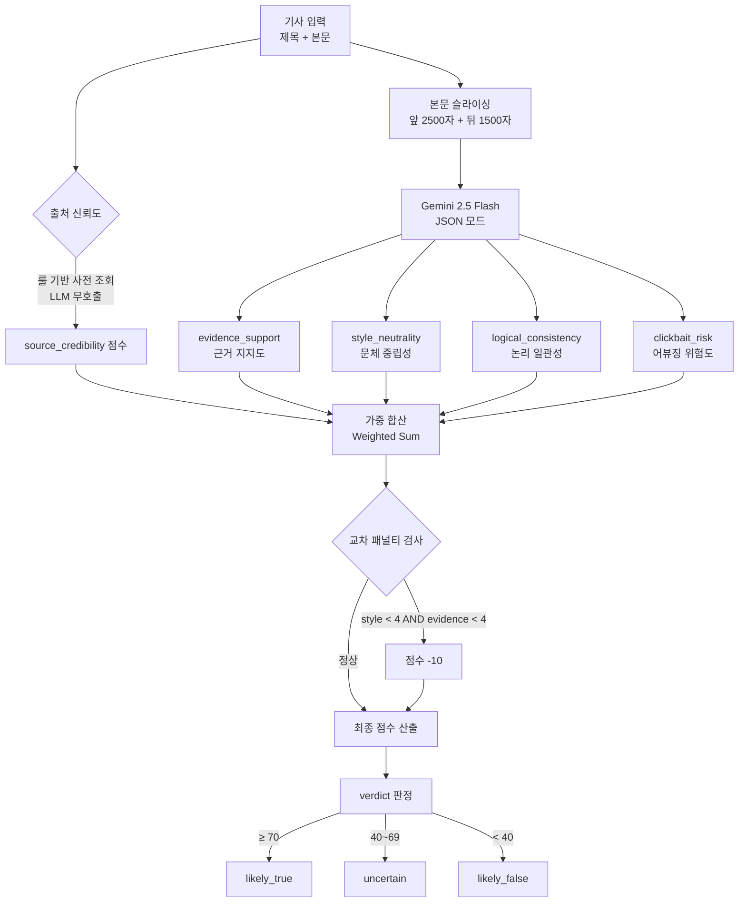
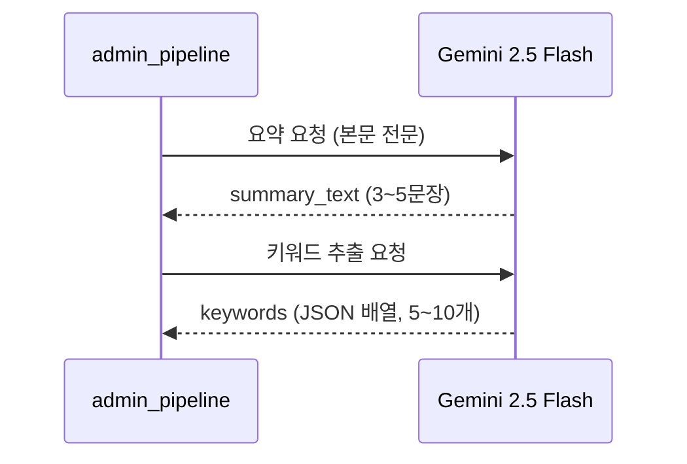
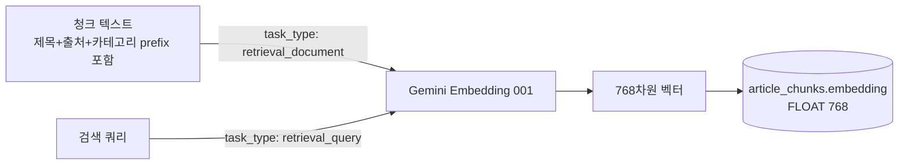

# AI / LLM

신뢰도 분석, 요약, 임베딩에 Google Gemini API를 사용한다. 구현은 `backend/services/trust.py`와 `backend/services/admin_pipeline.py`에 있다.

---

## 사용 모델

| 용도 | 모델 |
|------|------|
| 신뢰도 분석 | `gemini-2.5-flash` |
| 요약 / 키워드 추출 | `gemini-2.5-flash` |
| 텍스트 임베딩 | `models/gemini-embedding-001` (768차원) |

---

## 신뢰도 분석 파이프라인

TELLER 논문의 Cognitive System → Decision System → Explainability 구조를 기반으로 설계됐다.



---

## 신뢰도 5개 기준

| 기준 | 가중치 | 방향 | 설명 |
|------|--------|------|------|
| `source_credibility` | 0.20 | + | 출처 신뢰성 (연합뉴스 10점 ~ 블로그 3점) |
| `evidence_support` | 0.25 | + | 통계·전문가 인용 등 근거 지지도 |
| `style_neutrality` | 0.25 | + | 감정적 표현 회피, 중립 문체 |
| `logical_consistency` | 0.20 | + | 모순 없는 논리 전개 |
| `clickbait_risk` | -0.10 | − | 제목-본문 불일치, 어뷰징 패턴 |

### 점수 산출 공식

```
raw = source × 0.20
    + evidence × 0.25
    + style × 0.25
    + logical × 0.20
    - clickbait × 0.10

# 이론적 최대 raw (clickbait=0): (0.20+0.25+0.25+0.20) × 10 = 9.0

score_100 = (raw / 9.0) × 100  →  clamp(0, 100)

# 교차 패널티
if style_neutrality < 4 AND evidence_support < 4:
    score_100 -= 10
```

---

## 출처 신뢰도 (SOURCE_TIER)

LLM을 호출하지 않고 사전(dict)으로 처리한다.

```python
SOURCE_TIER = {
    "연합뉴스": 10,
    "KBS": 9, "MBC": 9, "SBS": 9, "YTN": 9,
    "조선일보": 8, "중앙일보": 8, "동아일보": 8,
    # ... (주요 언론사)
}
# 사전에 없는 출처: 기본값 5점
# 블로그/커뮤니티류: 3점
```

---

## Gemini 호출 방식

### 신뢰도 분석 프롬프트 구조

4개 기준(evidence, style, logical, clickbait)을 **단일 호출**로 처리한다.

```
시스템 역할: 뉴스 신뢰도 분석가
입력: 제목 + 슬라이싱된 본문 (최대 4000자)
출력: JSON 형식
{
  "evidence_support": {"score": 0~10, "reason": "..."},
  "style_neutrality": {"score": 0~10, "reason": "..."},
  "logical_consistency": {"score": 0~10, "reason": "..."},
  "clickbait_risk": {"score": 0~10, "reason": "..."},
  "overall_reason": "..."
}
```

- `response_mime_type = "application/json"` (JSON 모드 강제)
- 본문 슬라이싱: 앞 2500자 + 뒤 1500자 (중간 생략)

### Rate Limit 처리

```python
# 429 응답 시 자동 재시도
for attempt in range(3):
    try:
        response = model.generate_content(prompt)
    except ResourceExhausted:
        sleep(random(30, 60))
        continue
```

---

## 요약 / 키워드 추출

`admin_pipeline.py`에서 기사 저장 시 함께 처리한다.



- 요약과 키워드는 크롤링 시점에 1회 생성, DB에 저장
- `POST /api/admin/keywords`로 기존 기사 일괄 재처리 가능

---

## 임베딩



- **저장 시**: `task_type = "retrieval_document"`
- **검색 시**: `task_type = "retrieval_query"`
- 저장 위치: `article_chunks` 테이블의 `embedding FLOAT[768]` 컬럼
