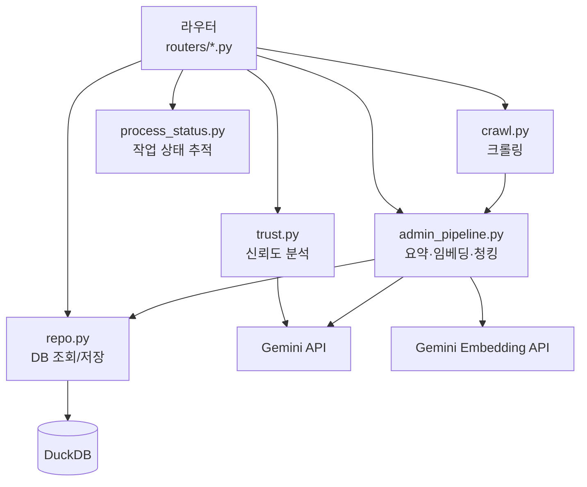

# 백엔드

FastAPI로 구현된 REST API 서버. `backend/main.py`가 진입점이고, `backend/routers/`에 라우터, `backend/services/`에 비즈니스 로직이 있다.

---

## 서버 초기화 (`main.py`)

```python
@asynccontextmanager
async def lifespan(app):
    repo.init_db()   # DuckDB 스키마 초기화 및 마이그레이션
    yield

app = FastAPI(lifespan=lifespan)
app.add_middleware(CORSMiddleware, allow_origins=ALLOWED_ORIGINS)

# 라우터 등록
app.include_router(articles.router, prefix="/api")
app.include_router(search.router,   prefix="/api")
app.include_router(admin.router,    prefix="/api")
app.include_router(trust.router,    prefix="/api")
app.include_router(feedback.router, prefix="/api")
```

- CORS 허용 도메인: 환경변수 `ALLOWED_ORIGINS` (쉼표 구분)
- 배포: `uvicorn backend.main:app --host 0.0.0.0 --port $PORT`

---

## API 엔드포인트

### Articles (`routers/articles.py`)

| 메서드 | 경로 | 설명 |
|--------|------|------|
| GET | `/api/articles` | 기사 목록 (페이지네이션, 카테고리 필터) |
| GET | `/api/articles/{id}` | 기사 상세 |
| GET | `/api/articles/{id}/related` | 관련 기사 5개 (시맨틱 검색) |
| GET | `/api/articles/{id}/thumbnail` | og:image 추출 또는 placeholder 반환 |

쿼리 파라미터:
- `page` (기본 1), `size` (기본 10)
- `category` (선택, 필터링)

### Search (`routers/search.py`)

| 메서드 | 경로 | 설명 |
|--------|------|------|
| POST | `/api/search` | 하이브리드 검색 (시맨틱 + BM25 RRF) |

요청:
```json
{ "query": "검색어", "limit": 10 }
```

응답:
```json
[
  {
    "article_id": "...",
    "title": "...",
    "source": "...",
    "trust_score": 75,
    "chunk_text": "...",
    "score": 0.92
  }
]
```

### Admin (`routers/admin.py`)

| 메서드 | 경로 | 설명 |
|--------|------|------|
| GET | `/api/admin/stats` | DB 통계 (총 기사수, 미분석 수, 카테고리별) |
| POST | `/api/admin/crawl` | 백그라운드 크롤링 시작 |
| POST | `/api/admin/analyze` | 미분석 기사 일괄 신뢰도 분석 |
| POST | `/api/admin/dedupe` | 중복 기사 제거 (Jaccard ≥ 0.8) |
| POST | `/api/admin/keywords` | 키워드 일괄 추출 |
| GET | `/api/admin/process-status` | 백그라운드 작업 상태 (로그 폴링용) |

크롤링 요청:
```json
{
  "max_articles_per_category": 10,
  "categories": ["정치", "경제"],
  "total_articles": 50
}
```

### Trust (`routers/trust.py`)

| 메서드 | 경로 | 설명 |
|--------|------|------|
| GET | `/api/trust/{id}` | 기사 신뢰도 상세 (per_criteria 포함) |

### Feedback (`routers/feedback.py`)

| 메서드 | 경로 | 설명 |
|--------|------|------|
| POST | `/api/feedback` | 피드백 저장 (like/dislike) |
| GET | `/api/feedback` | 전체 피드백 조회 |

---

## DB 스키마

DuckDB를 사용한다. 로컬 파일 또는 MotherDuck 클라우드에 연결한다.

### articles 테이블

```sql
CREATE TABLE articles (
    article_id          VARCHAR PRIMARY KEY,
    title               VARCHAR,
    source              VARCHAR,
    url                 VARCHAR,
    published_at        VARCHAR,
    category            VARCHAR,        -- "정치", "경제", ... (NULL → "연예" 마이그레이션)
    full_text           VARCHAR,
    summary_text        VARCHAR,
    keywords            VARCHAR,        -- JSON 배열 문자열 예: '["AI", "기술"]'
    embed_full          VARCHAR,        -- 미사용 (placeholder "[]")
    embed_summary       VARCHAR,        -- 미사용
    trust_score         INTEGER,        -- 0~100 (미분석: 0)
    trust_verdict       VARCHAR,        -- "likely_true" | "uncertain" | "likely_false"
    trust_reason        VARCHAR,        -- Gemini 생성 종합 판단
    trust_per_criteria  VARCHAR,        -- JSON 문자열 (5개 기준 상세)
    status              VARCHAR         -- "ready"
);
```

### article_chunks 테이블

```sql
CREATE TABLE article_chunks (
    chunk_id    VARCHAR PRIMARY KEY,    -- "{article_id}_{index}"
    article_id  VARCHAR,
    chunk_text  VARCHAR,               -- Contextual Chunking 적용 텍스트
    embedding   FLOAT[768]             -- Gemini Embedding 001
);
```

### feedback_logs 테이블

```sql
CREATE TABLE feedback_logs (
    feedback_id     VARCHAR PRIMARY KEY,
    article_id      VARCHAR,
    feedback_type   VARCHAR,    -- "like" | "dislike"
    created_at      VARCHAR
);
```

---

## MotherDuck 연결

환경변수 `MOTHERDUCK_TOKEN`이 있으면 클라우드 DB에, 없으면 로컬 파일 DB에 연결한다.

```python
# repo.py
MOTHERDUCK_TOKEN = os.getenv("MOTHERDUCK_TOKEN")

if MOTHERDUCK_TOKEN:
    con = duckdb.connect(f"md:?motherduck_token={MOTHERDUCK_TOKEN}")
else:
    con = duckdb.connect("news.db")  # 로컬 파일
```

모든 DB 작업은 `repo.py`의 함수를 통해 처리한다. 직접 쿼리를 여러 곳에서 분산 실행하지 않는다.

---

## DB 마이그레이션

서버 시작 시 `init_db()`에서 자동 실행한다.

```python
# category 컬럼 없으면 추가
ALTER TABLE articles ADD COLUMN category VARCHAR

# NULL 또는 미분류 → "연예"
UPDATE articles SET category = '연예' WHERE category IS NULL

# 테스트 아티팩트 삭제
DELETE FROM articles WHERE title LIKE '%Britain Royals%'
```

---

## 서비스 레이어 흐름



### 주요 서비스

| 파일 | 역할 |
|------|------|
| `repo.py` | DuckDB CRUD + 시맨틱/BM25/하이브리드 검색 |
| `trust.py` | 신뢰도 5기준 분석 (Gemini 호출 + 점수 계산) |
| `admin_pipeline.py` | 요약·키워드·청킹·임베딩 오케스트레이션 |
| `crawl.py` | 네이버 뉴스 크롤링 |
| `process_status.py` | 백그라운드 작업 진행 상태·로그 관리 |
| `config.py` | 환경변수에서 Gemini API 키 로드 |
