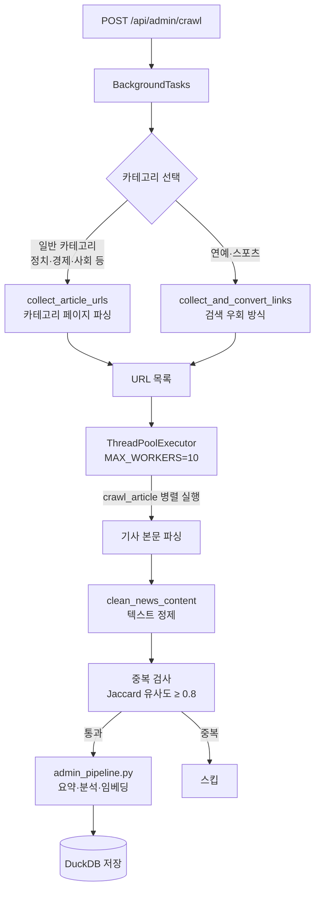
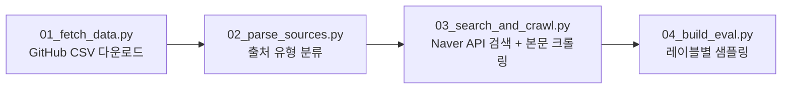

# 크롤러

네이버 뉴스에서 기사를 수집하는 모듈. `backend/services/crawl.py`에 구현되어 있다.

---

## 크롤링 대상

8개 카테고리를 대상으로 한다.

| 카테고리 | 코드 |
|---------|------|
| 정치 | 100 |
| 경제 | 101 |
| 사회 | 102 |
| 생활/문화 | 103 |
| 세계 | 104 |
| IT/과학 | 105 |
| 연예 | 106 |
| 스포츠 | 107 |

- **최대 병렬 워커**: `MAX_WORKERS = 10` (ThreadPoolExecutor)
- **요청 간격**: 카테고리별 URL 수집 후 기사 본문은 병렬로 크롤링

---

## 전체 흐름



---

## 주요 함수

| 함수 | 역할 |
|------|------|
| `collect_article_urls(sid, category)` | 카테고리 페이지에서 기사 URL 목록 수집 |
| `collect_and_convert_links()` | 연예/스포츠 전용 URL 수집 (검색 페이지 우회) |
| `crawl_article(url_cat)` | 기사 1건 파싱 (제목, 출처, 본문, 발행일, 댓글수, 추천수) |
| `clean_news_content(text)` | 기자명, 이메일, URL, 언론사명 제거 |
| `clean_reporter_name(name)` | 기자명 표준화 (접미사 제거) |
| `compute_jaccard_similarity(t1, t2)` | 제목 Jaccard 유사도 계산 (중복 검사용) |

---

## 기사 파싱 세부사항

### 제목 / 출처 / 발행일
- **제목**: `<h2 class="media_end_head_headline">`, `<h3 id="articleTitle">`
- **출처**: `og:article:author` 메타태그 또는 미디어 로고 alt 텍스트
- **발행일**: `og:article:published_time` 메타태그

### 본문 선택자 (우선순위 순)
1. `div._article_content`
2. `#dic_area`
3. `#articleBodyContents`

### 반응 데이터
- **추천 수**: Naver Like API (`https://like.naver.com/v1/search/...`)
- **댓글 수**: Naver Comment API (`https://apis.naver.com/commentBox/cbox5/...`)

---

## 텍스트 정제 (`clean_news_content`)

제거 대상:
- 맨 앞의 `[제목]` / `[언론사명]` 패턴
- 기자명 + 이메일 조합 (`홍길동 기자 hong@news.com`)
- 단독 이메일 주소
- HTTP/HTTPS URL
- `▶`, `◀` 같은 특수 기호

---

## 중복 제거

크롤링 시점과 배치 작업(`POST /api/admin/dedupe`) 두 단계에서 처리한다.

```python
# Jaccard 유사도 계산
tokens_a = set(title_a.split())
tokens_b = set(title_b.split())
similarity = len(tokens_a & tokens_b) / len(tokens_a | tokens_b)

# 0.8 이상이면 중복으로 판정
```

---

## 예외 처리

| 상황 | 처리 방식 |
|------|---------|
| HTTP 오류 / 타임아웃 | 해당 기사 스킵, 로그 기록 |
| 본문 200자 미만 | 스킵 (유효하지 않은 기사로 판단) |
| 중복 기사 | DB upsert (기존 레코드 유지, 재삽입 방지) |
| 연예/스포츠 URL 변환 실패 | 해당 항목 스킵 |

---

## 크롤링 실험 파이프라인 (`crawl_exp/`)

SNU 팩트체크 데이터를 활용해 신뢰도 모델 검증용 평가셋을 구축하는 별도 파이프라인이다.



출처 유형 분류:

| 유형 | 조건 | 검색 전략 |
|------|------|---------|
| TYPE_A | 언론사명 + 제목 힌트 있음 | 제목 힌트로 검색 |
| TYPE_B | 언론사명만 있음 | 팩트체크 주장으로 검색 |
| TYPE_C | 언론사 자체 문제제기 | 팩트체크 주장 검색 |
| TYPE_D | 발언/성명류 | 관련 보도 검색 |
| SKIP | SNS·커뮤니티·유튜브 | 건너뜀 |
