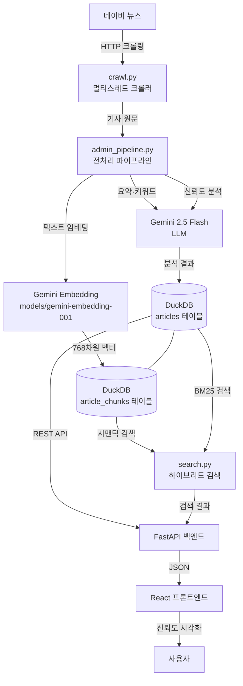

# 시스템 개요

ET(Explainable Trust)는 네이버 뉴스 기사를 수집하고, AI로 신뢰도를 분석하며, RAG 기반 시맨틱 검색을 제공하는 뉴스 신뢰도 평가 웹 서비스다.

---

## 전체 흐름

---

## 주요 컴포넌트

| 컴포넌트 | 위치 | 역할 |
|---------|------|------|
| 크롤러 | `backend/services/crawl.py` | 네이버 뉴스 8개 카테고리 수집 (ThreadPoolExecutor) |
| 신뢰도 분석 | `backend/services/trust.py` | TELLER 기반 5개 기준 AI 평가 |
| 전처리 파이프라인 | `backend/services/admin_pipeline.py` | 요약·키워드·임베딩·청킹 오케스트레이션 |
| 저장소 | `backend/services/repo.py` | DuckDB CRUD + 벡터 검색 + BM25 |
| API 서버 | `backend/main.py` + `routers/` | FastAPI REST API |
| 프론트엔드 | `frontend/src/` | React 19 + TanStack Query + Tailwind |
| 평가셋 빌더 | `crawl_exp/` | SNU 팩트체크 기반 검증 데이터 구축 |

---

## 기술 스택

| 분류 | 기술 |
|------|------|
| **백엔드** | Python 3, FastAPI, Uvicorn |
| **AI/LLM** | Google Gemini 2.5 Flash (분석·요약), Gemini Embedding 001 (임베딩) |
| **DB** | DuckDB (로컬), MotherDuck (클라우드) |
| **검색** | DuckDB cosine_similarity (시맨틱), rank-bm25 (BM25), RRF (하이브리드) |
| **프론트엔드** | React 19, TypeScript, Vite, TanStack Query, Tailwind CSS, Axios |
| **크롤링** | requests, BeautifulSoup4, ThreadPoolExecutor |
| **배포** | Heroku (Procfile: uvicorn) |
| **외부 API** | Naver 뉴스 검색 API, Naver Like/Comment API |
