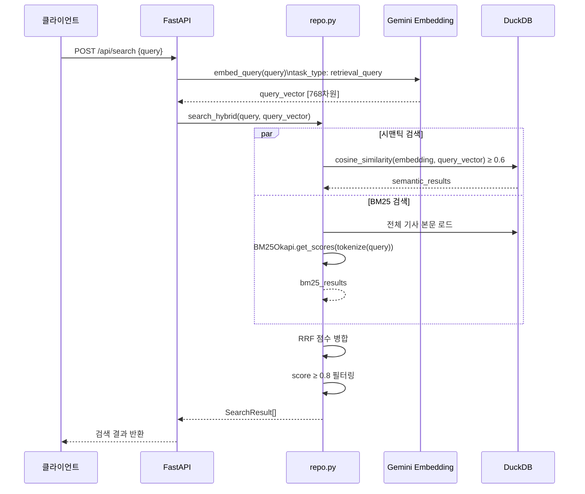

# RAG / 검색

기사 본문을 청크로 분할하고 벡터로 저장한 뒤, 검색 시 시맨틱 검색과 BM25를 RRF로 결합하는 하이브리드 검색을 사용한다. `backend/services/repo.py`와 `admin_pipeline.py`에 구현되어 있다.

---

## 전체 흐름



---

## 청킹 전략

`RecursiveCharacterTextSplitter`를 사용한다.

```python
RecursiveCharacterTextSplitter(
    chunk_size=400,        # 청크 최대 크기 (자)
    chunk_overlap=150,     # 청크 간 중첩 크기
    separators=[
        "다.\n", "다. ",   # 한국어 문장 단위 우선
        ".\n", ". ",
        "\n\n", "\n",
        " ", ""
    ]
)
```

- **400자**: 의미 단위를 유지하면서 임베딩 정확도 확보
- **150자 중첩**: 문장이 청크 경계에서 끊기더라도 문맥 연속성 유지
- 기사 1건당 평균 2~4개 청크 생성

---

## Contextual Chunking

청크에 기사의 메타데이터를 prefix로 추가해서 문맥 정보를 강화한다.

```
[제목: {title}] [출처: {source}] [카테고리: {category}]
{chunk_text}
```

이 prefix가 포함된 텍스트 전체를 임베딩한다. 청크만 단독으로 임베딩할 때보다 검색 정확도가 높다.

---

## 벡터 저장 구조

```sql
CREATE TABLE article_chunks (
    chunk_id  VARCHAR PRIMARY KEY,   -- "{article_id}_{index}" 또는 "{article_id}_title"
    article_id VARCHAR,
    chunk_text VARCHAR,              -- Contextual Chunking 적용된 텍스트
    embedding  FLOAT[768]            -- Gemini Embedding 001 출력
);
```

- `chunk_id` 형식: `"abc123_0"`, `"abc123_1"`, `"abc123_title"`
- `_title` 청크: 제목만으로 만든 임베딩 (제목 기반 검색 강화용)
- DuckDB의 `FLOAT[768]` 타입으로 저장, `cosine_similarity()` 내장 함수로 검색

---

## 시맨틱 검색 (`search_similar_chunks`)

```sql
SELECT
    c.chunk_id,
    c.chunk_text,
    c.article_id,
    cosine_similarity(c.embedding, $query_vector) AS score,
    a.title,
    a.source,
    a.trust_score,
    a.trust_verdict
FROM article_chunks c
JOIN articles a ON c.article_id = a.article_id
WHERE cosine_similarity(c.embedding, $query_vector) >= 0.6
ORDER BY score DESC
LIMIT 10
```

**De-duplication**: 동일 기사의 청크가 여러 개 검색되면 점수가 가장 높은 1개만 선택한다.

---

## BM25 검색 (`search_bm25`)

```python
# 한국어 토크나이저 (2글자 이상만 추출)
def tokenize(text):
    return re.findall(r'[가-힣a-zA-Z0-9]{2,}', text)

# 코퍼스: 제목 + 본문 결합
corpus = [tokenize(f"{a.title} {a.full_text}") for a in articles]
bm25 = BM25Okapi(corpus)

# 쿼리 점수 계산
scores = bm25.get_scores(tokenize(query))

# 정규화 후 0.7 이상만 반환
normalized = scores / max(scores)
results = [(article, score) for article, score in zip(articles, normalized) if score >= 0.7]
```

---

## 하이브리드 검색 + RRF (`search_hybrid`)

RRF(Reciprocal Rank Fusion)로 두 결과를 결합한다.

```python
# RRF 점수 계산
k = 60  # 상수 (순위 안정화용)

for rank, result in enumerate(semantic_results):
    rrf_scores[result.article_id] += 1 / (k + rank + 1)

for rank, result in enumerate(bm25_results):
    rrf_scores[result.article_id] += 1 / (k + rank + 1)

# 정규화
max_rrf = max(rrf_scores.values())
final_scores = {id: score / max_rrf for id, score in rrf_scores.items()}

# 0.8 이상만 최종 반환
results = [(id, score) for id, score in final_scores.items() if score >= 0.8]
```

### 임계값 정리

| 단계 | 임계값 | 의미 |
|------|--------|------|
| 시맨틱 필터 | cosine ≥ 0.6 | 후보 수집 |
| BM25 필터 | normalized ≥ 0.7 | 후보 수집 |
| RRF 최종 | score ≥ 0.8 | 클라이언트에 반환 |

---

## 관련 기사 검색

기사 상세 페이지의 "관련 기사 5개"도 동일한 시맨틱 검색을 사용한다.

```python
GET /api/articles/{id}/related

# 해당 기사의 임베딩을 쿼리 벡터로 사용
# 자기 자신 제외 후 상위 5개 반환
```
