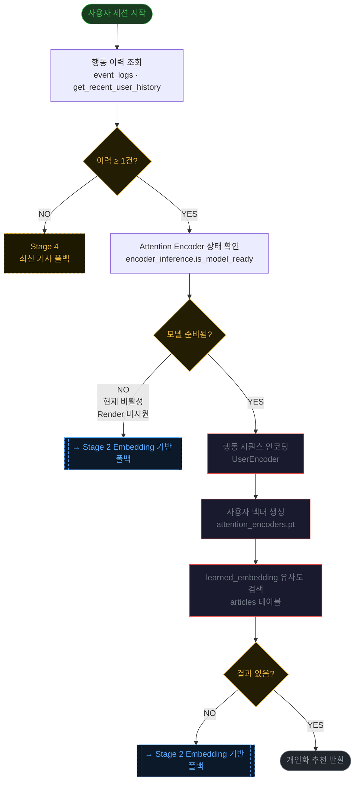
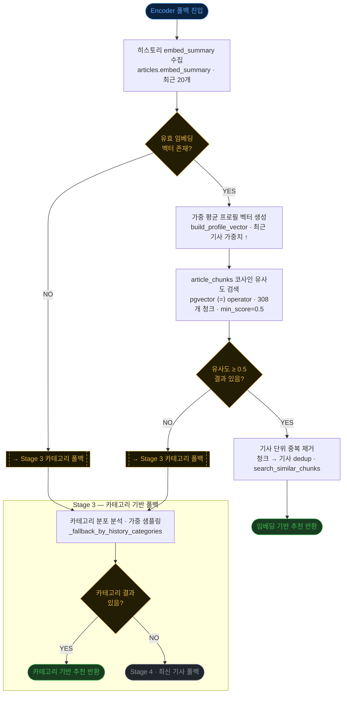

# 추천 시스템 플로우차트

> ET_by_claude · 2026-07-03 기준 배포 상태

---

## Chart 1 — Attention Encoder 기반 추천 (Stage 1 · 현재 비활성)

UserEncoder가 사용자 행동 시퀀스를 벡터로 압축해 `learned_embedding` 공간에서 유사 기사를 탐색한다.
`torch` 미설치 환경(Render 무료 플랜)에서는 `is_model_ready()` → `False`이므로 항상 Stage 2로 폴백된다.

---

## Chart 2 — 임베딩 기반 추천 (Stage 2 · 현재 활성 / Encoder Fallback)

Gemini `embed_summary` 벡터의 가중 평균으로 사용자 프로필을 구성하고,
pgvector 코사인 유사도로 `article_chunks` 308개를 탐색한다.
Stage 2 실패 시 카테고리(Stage 3) → 최신 기사(Stage 4)로 단계적 폴백한다.

---

## 현재 배포 상태 요약 (2026-07-03)

| Stage | 방식 | 상태 | 근거 |
|-------|------|------|------|
| 1 | Attention Encoder (PyTorch) | ❌ 비활성 | torch 미설치 (Render 무료 플랜) |
| **2** | **임베딩 유사도 (pgvector)** | **✅ 활성** | embed_summary 전체 분석 완료, 청크 308개 |
| 3 | 카테고리 기반 | ✅ 대기 | 카테고리 6종 분류됨 |
| 4 | 최신 기사 | ✅ 항상 | 신규 사용자 폴백 |
